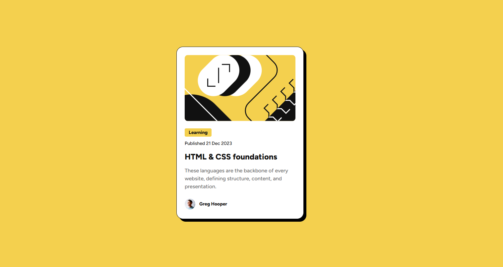

# Frontend Mentor - Blog preview card solution

This is my solution to the [Blog preview card challenge on Frontend Mentor](https://www.frontendmentor.io/challenges/blog-preview-card-ckPaj01IcS). Frontend Mentor challenges help improve your front-end skills by building real projects.

## Table of contents

- [Overview](#overview)
  - [The challenge](#the-challenge)
  - [Screenshot](#screenshot)
  - [Links](#links)
- [My process](#my-process)
  - [Built with](#built-with)
  - [What I learned](#what-i-learned)
  - [Continued development](#continued-development)
  - [Useful resources](#useful-resources)
- [Author](#author)

## Overview

### The challenge

Users should be able to:

- View the blog card component centered on the screen
- See hover states for interactive elements (e.g., blog title)

### Screenshot



### Links

- Solution URL: [Frontend Mentor](https://www.frontendmentor.io/solutions/responsive-blog-preview-card-ZMVUXuIZ_x)
- Live Site URL: [Live Site](https://pedrohfidg.github.io/blog-preview-card)

## My process

### Built with

- Semantic HTML5 markup
- CSS custom properties (variables)
- Flexbox
- Media queries for responsiveness
- Mobile-first workflow
- Custom fonts using `@font-face`

### What I learned

This challenge helped reinforce best practices in component layout and accessibility with semantic HTML. I also practiced custom font integration and hover effects using cursor images.

Example of using a custom font with `@font-face`:

```css
@font-face {
  font-family: "Figtree";
  src: url("../assets/fonts/static/Figtree-ExtraBold.ttf") format("truetype");
  font-weight: 800;
  font-style: normal;
}
```

Example of a custom hover cursor:

```css
.blog-card-title:hover {
  cursor: url("../assets/images/Pointer.png"), auto;
}
```

### Continued development

In future projects, I want to:

- Explore using utility-first CSS frameworks like Tailwind
- Practice accessibility (a11y) features and keyboard navigation
- Build reusable card components using React

### Useful resources

- [CSS Flexbox Guide (MDN)](https://developer.mozilla.org/en-US/docs/Web/CSS/CSS_flexible_box_layout/Basic_Concepts_of_Flexbox)
- [Figma to Code: Font management and styling](https://www.figma.com/blog/how-fonts-work/)
- [CSS Custom Properties Guide](https://css-tricks.com/a-complete-guide-to-custom-properties/)

## Author

- Frontend Mentor - [@pedrohfidg](https://www.frontendmentor.io/profile/pedrohfidg)
- GitHub - [@pedrohfidg](https://github.com/pedrohfidg)
